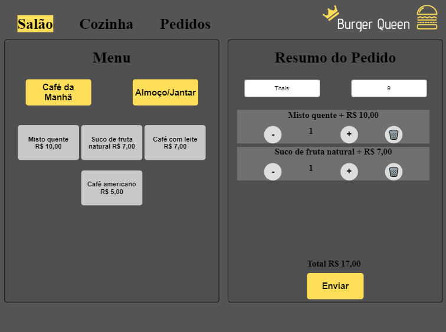
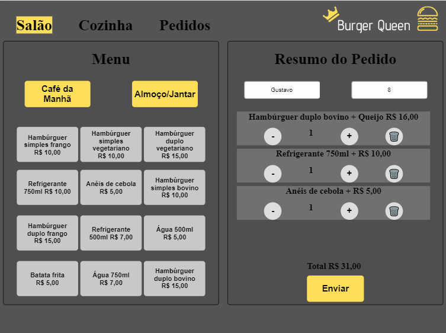
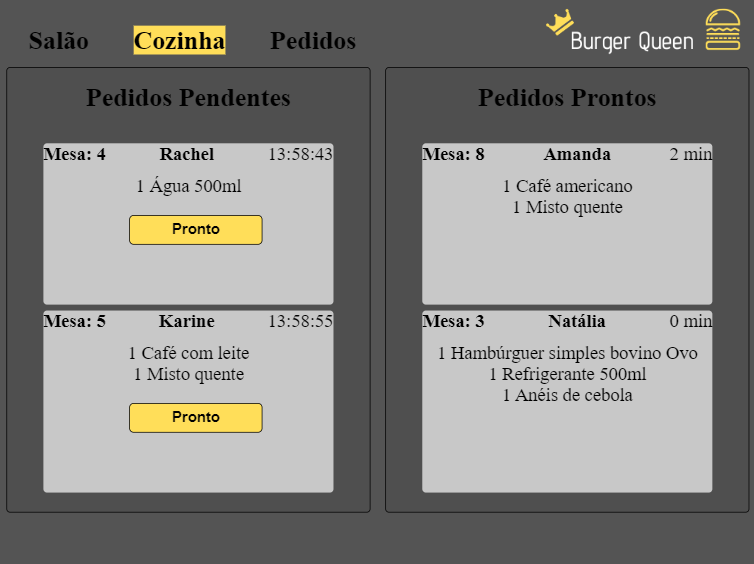
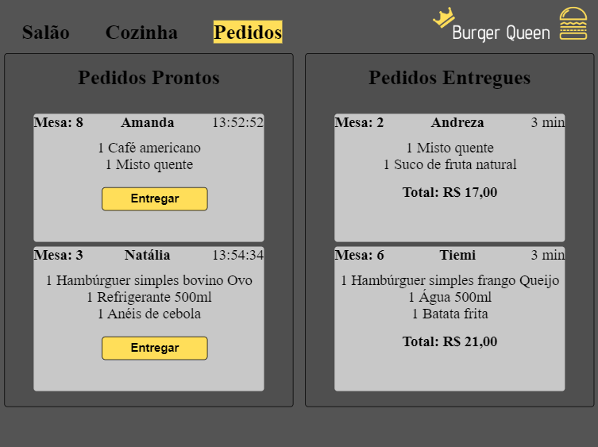

# Burger Queen

## Índice

* [1. Burger Queen](#1-burger-queen)
* [2. Resumo do projeto](#2-resumo-do-projeto)
* [3. Tecnologias](#3-tecnologias)
* [4. Interface](#4-interface)

***

## 1. Burger Queen

Projeto realizado durante o bootcamp da Laboratória.  

 Interface para realizar pedidos através de um tablet, e enviá-los para a cozinha instantaneamente para que sejam preparados de forma ordenada e eficiente.

## 2. Resumo do projeto

A interface do Salão deverá mostrar dois menus (café da manhã e almoço/jantar) contendo seus respectivos produtos. O usuário poderá escolher e adicionar os produtos e a interface deve mostrar o resumo do pedido com o custo total.  

A interface da Cozinha deverá receber o pedido a ser preparado e enviá-lo de volta ao atendente quando o prato estiver pronto, também deverá ter um histórico dos pedidos prontos para entrega.

O Atendente deverá receber de forma instantânea o prato finalizado para a entrega ao cliente, também deverá ter um histórico dos pedidos entregues.  

## 3. Tecnologias

### Tecnologias  

* HTML5
* JavasScript (ES6)
* Aphrodite (CSS)
* React Hooks
* Firebase
* growl-alert
* Trello

## 4. Interface

